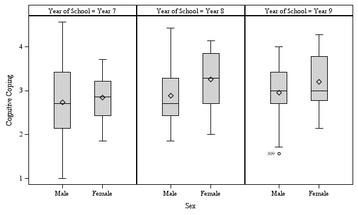
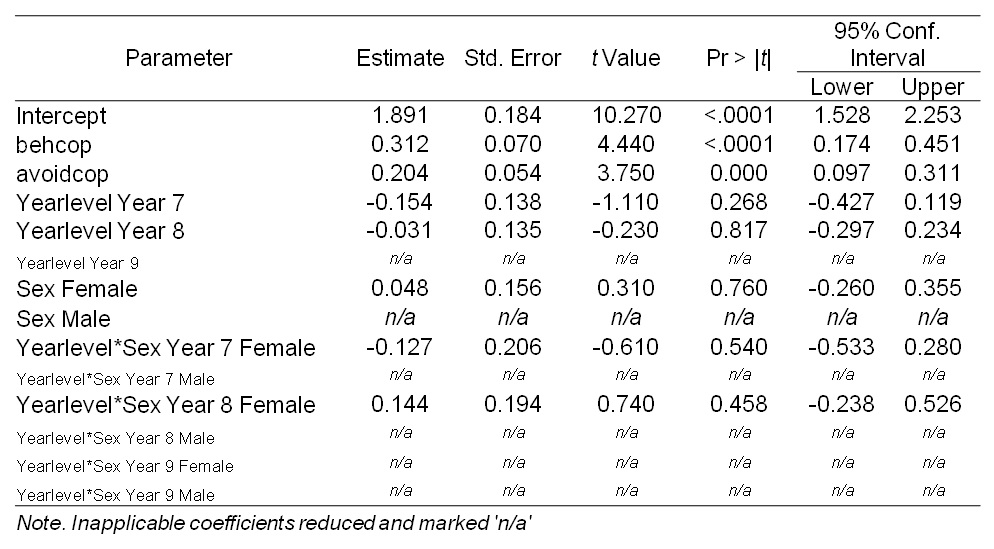
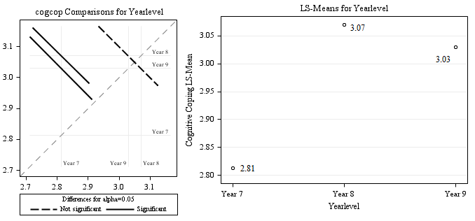
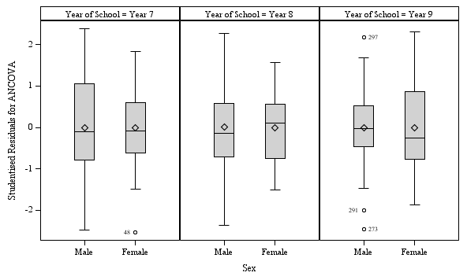

*General Linear Model*
======================

The starting assumption of this report was that 'cognitive coping skills' can be improved without a specific treatment or intervention. The first research aim was whether this improvement was related to 'age'; whether 'cognitive coping' improved as an individual matures into adulthood without intervention. The second research aim was whether this improvement was related to 'sex'; whether gender changes the development of cognitive coping skills.

The first hypothesis was that measured 'cognitive coping skills' would increase with 'year level' (H<sub>1</sub>: *year level* up = *cognitive coping* up). The second hypothesis was that observed increases would be larger in females than in males (H<sub>2</sub>: *year level* X *female* up = *cognitive coping* up). 'Behavioural coping' and 'avoidance coping' were two important variables that could potentially confound the analysis. These variables were controlled for using analysis of covariance (ANCOVA).

Data
====

The data set consisted of 74 children from Year seven, 96 from Year eight and 59 from Year nine, with mean ages of 12, 13 and 14 years respectively. 'Cognitive coping' levels were plotted.




*Figure 1*. Box plots of 'cognitive coping skills' panelled by 'sex' and 'year level'.

The above box plots showed that females were slightly higher on levels of 'cognitive coping' in each 'year level'. The variances between levels appeared to be different. This may have influenced the statistical analysis, but based on the magnitude of differences between groups, the only means of confirming a difference was statistical analysis.

Analysis
========

The ANOVA was carried out via PROC GLM. The parameter estimates were tabled below for interpretation.

Table 1. *ANCOVA Parameters*



For the variable 'Year Level', the low *t*-values shown for the main effects tabled above (e.g. Year 7, Year 8) where misleading. Although both years were not significant in parameter estimates, the model-wide contribution was significant, *F*(2, 221)=4.26, *p*\<.05. Marginal means for this variable were plotted for analysis.



*Figure 2*. Marginal means for Year Level

The two differences between 'year level' that were significant to the *alpha*=.05 level where between Year 7 and the two other levels, Year 8 (*p*=0.005) and Year 9 (*p*=0.035). Note that the difference between these means is very small. It is unlikely that these differences would remain after an experiment-wise error correction (e.g. Bonferroni), particularly if the other comparisons where significant and then analysed for significance, as originally hypothesised.

The other main effect was 'sex'. This was not significant in the parameters nor in model-wise contribution, *F*(1, 221)=0.41, *p*=.52. Similarly, the interaction effect was not significant in either the parameter estimates or the model, *F*(2, 221)=1.12, *p*=.33. As these variables and interactions where not significant it is not appropriate to make conclusions from their marginal means.

Box plots of the residuals were produced to assess normality and constant variance.



*Figure 3*. Box Plots of Studentised Residuals by Year Level and Sex

The range of the box plots suggested non-constant variance in every 'year level'. There are four unusual points and asymmetry between most groups. Based on these residuals it is possible that this analysis violated ANCOVA assumptions and the results were not reliable.

Conclusion
=======================

Based on the above results the first hypothesis was supported: As 'year level' increased 'cognitive coping skills' tended to increase. However, residual analysis revealed that some ANCOVA assumptions were violated. Moreover, additional assumptions of the theory may be incorrect. It may be that the relationship between the covariates, that is the other two coping methods, was not the same for each 'year level' nor for both sexes.

Future research may benefit from a limited multiple regression model that can output a predictive formula for 'cognitive coping' and 'year level'. Before the above ANCOVA is repeated a larger sample should be procured, because this research shows that the relationships will be small. When a true relationship is identified, it may not withstand experiment-wise error correction. Finally, more time should be spent on theory, to ensure that ANCOVA assumptions about covariate uniformity are not violated.

Appendix. SAS Code
==================

```sas
proc import out=teenager
file='E:\SASdata\TEENAGER.sav'
dbms=spss replace;
run;
proc sort data=teenager out=temp;
by yearlevel;
run;
proc summary;
var age;
by yearlevel;
output out=temp
n=N mean=M stddev=SD;
run; proc print noobs; run;
ods graphics on / noborder height=9cm width=15cm;
proc sgpanel data=teenager;
panelby yearlevel / rows=1;
vbox cogcop / category=sex datalabel=id;
colaxis label='Sex';
run;
ods graphics off;

ods graphics on / noborder height=8cm;
proc glm data=teenager plots=all;
class yearlevel sex;
model cogcop = behcop avoidcop yearlevel sex yearlevel*sex
/ solution clparm ;
lsmeans yearlevel sex yearlevel*sex / TDIFF PDIFF;
output out=residplot r=r RSTUDENT=r2;
ods output ParameterEstimates=ests;
run; quit;
proc sort data=residplot out=residplot;
by yearlevel sex;
run;
ods graphics on / noborder height=9cm width=15cm;
proc sgpanel data=residplot;
panelby yearlevel / rows=1;
vbox r2 / category=sex datalabel=id;
colaxis label='Sex';
rowaxis label='Studentised Residuals for ANCOVA';
run;
ods graphics off;
```
