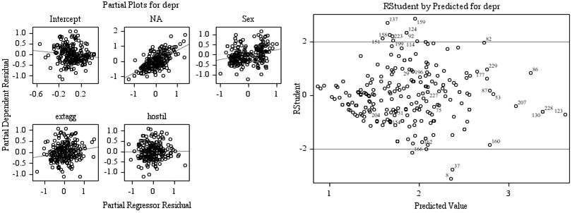

-   *Simple, Piecewise & Non-Linear*
-   Simple Models
    -   Exploratory Analysis
    -   Simple Linear Regression
    -   Validity of Regression Assumptions
        -   Linearity
        -   Homoscedasticity
        -   Independence
-   Alternative Models
    -   Polynomial
    -   Piecewise Linear Model
    -   Non-linear Model with Bootstrapped Knot
-   Comparison
-   Complex Relationships
    -   Mediation
    -   Moderation
    -   Two-Stage Hierarchical Model
        -   Unusual points or Multicollinearity
        -   Partial & Residual Plots
-   Appendix. SAS Code

*Simple, Piecewise & Non-Linear*
================================

The data set addresses the relationship between depression levels, *depr*, and external aggression, *extagg*.

Simple Models
=============

A simple linear regression model was used to predict *depr* from *extagg*.

Exploratory Analysis
--------------------

The aim was to create a simple linear regression (SLR) model of the relationship between 'depression levels' (response variable) and 'external aggression' (predictor variable). An exploratory analysis was undertaken to determine whether this model was suitable for this relationship. Starting with 'depression levels', the variable distributions were explored below with box plots and summary statistics.


*Figure 1*. Depression Box Plot (*N*=229, *M*=1.86, *SD*=0.62, Skew=0.44, Kurt=-0.68)

'Depression levels' have low skew and kurtosis with no outliers. These data diverged from normality because they clustered towards the lower end of the distribution. They were normal enough to support regression. Next 'external aggression' was examined.


*Figure 2*. Aggression Box Plot (*N*=229, *M*=2.13, *SD*=0.85, Skew=1.06, Kurt=-0.67)

'External aggression' was less normal than 'depression levels'. The box plot identified a stronger positive skew and several outliers that may become influential points in the linear regression. The univariate normality of this predictor variable was not ideal but was satisfactory for inclusion in a linear regression. Next the relationship between the response and predictor variable was assessed to determine whether it could support a regression.


*Figure 3*. Scatter Plots and Histograms with Normal and Kernel Distributions

The histograms in the above panel (Figure 3) corroborated the previous indication of positive skew indicated by the box plots (Figures 1 and 2). Data points clustered to the bottom-left in the panelled scatter plots that depicted the bivariate relationship. While the relationship appeared linear, the data points were scattered broadly at higher levels of both variables, which can cause residual heteroscedasticity in SLR models.

A Pearson's *r* correlation indicated whether the relationship was sufficient to support a linear regression. It produced a borderline weak to moderate correlation (*r*=.40, *N*=229, *p*\<.001) that was highly significant. This was sufficient justification to develop a SLR model.

Simple Linear Regression
------------------------

A SLR model of the form,

*yhat=beta<sub>0</sub>+beta<sub>1</sub>X+epsilon*

predicting 'depression level' (*yhat*) with 'external aggression' (*X*) was computed.

'External aggression' significantly predicted 'depression levels', *beta*<sub>1</sub>=0.288, *t*(227)=6.56, *p*\<.001 and explained a significant proportion of variance, Adj-*R*<sup>2</sup>=.156, *F*(1, 227)=42.99, *p*\<.001. Note that Adj-*R*<sup>2</sup> was referenced, not *R*<sup>2</sup>, to allow better comparisons with later models that include multiple regressors. The predictions and residuals were plot.


*Figure 4*. Depression by Aggression Fit and Residual Plot with LOESS

The above fit plot showed how the regression model fit the bivariate linear relationship and the residuals reflected the issues indicated by the skewed distributions. Most data values were clumped at the lower end of the regressor and there was minor fanning out. There were several large residual values and some systematic overestimation (i.e. predicted values too high) at the higher end of the regressor domain. Overall this suggested nonconstant variance or heteroscedasticity. Nevertheless, the LOESS smother was a straight line through the residuals, which demonstrated that not obvious non-linear pattern was missed.

Although the 'variance explained' and overall model were both significant this did not indicate that the SLR produced a good model for this relationship. There was a linear relationship, as demonstrated by prior correlation and plotting, but the high significance of the model was likely to be an artefact of the moderate sample size. For instance, the low Adj-*R*<sup>2</sup> meant that only 15.6% of the variation in 'depression levels' was explained by external aggression. Moreover, a plot of the *Cook's D* for all observations showed that several data points exhibited unusual influence over the regression.


*Figure 5*. First Model *Cook's D*

This was attributed to the wide data dispersion and the weak model. Noted here for the purposes of later comparison, the *Akaike's Information Criterion* (AIC) was -259.3, *Sawa's Bayesian Information Criterion* (BIC) was -257.2, and the *Schwarz Bayesian Criteria* (SBC) was -252.4. The regression equation was *Depression Level*=1.252+0.288(*External Aggression*), meaning a one unit increase in 'external aggression' predicted a 0.288 increase in 'depression levels'.

Validity of Regression Assumptions
----------------------------------

### Linearity

The absence of higher-order relationships was supported by the exploratory analysis (Figure 3). The main evidence of a non-linear relationship was that the model over-estimated predicted values for one small section of the regressor domain. This was insufficient to distort a LOESS smoother.

### Homoscedasticity

Residuals were plot to assess homoscedasticity.


*Figure 6*. Studentised Residuals by Predicted Values

The above plot showed studentised residuals by predicted values. At the lower domain of the regressor there was systematic underestimation, with several large residual values (i.e. |*epsilon*|\>2) and a floor effect that may have been a product of measurement. Values in that domain clustered abnormally in a line. There was minor fanning out at higher domains and consequently heteroscedasticity.

### Independence

First order autocorrelation and the Durbin-Watson (DW) statistic (H<sub>0</sub>: Lag 1 *epsilon* are uncorrelated) assessed independence. The autocorrelation was very low (*rho<sub>i</sub>*=0.089). The DW value of 1.8 was high enough to indicate that this low positive autocorrelation between consecutive responses was not significant. Also, the DW value was between *DW<sub>U</sub>* and 4-*DW<sub>U</sub>* values, indicating a random sample at the *alpha*=.05 level of significance (*T*=229, *K*=2, *DW<sub>L</sub>*=1.77525, *DW<sub>U</sub>*=1.79270).

Alternative Models
==================

Polynomial, piecewise and non-linear models were trained and compared to determine if a superior fit could be achieved.

Polynomial
----------

The first alternative method was a polynomial regression. This model required higher order predictors in the form,

*yhat=beta<sub>0</sub>+beta<sub>1</sub>(x-xbar)+beta<sub>2</sub>(x-xbar)<sup>2</sup>+beta<sub>3</sub>(x-xbar)<sup>3</sup>+epsilon*

which were mean centred to reduce multicollinearity and variance inflation. It included the same variables (*yhat*='depression levels', *x*='external aggression') in addition to higher order transformations of the mean centred *x* regressor. Quadratic and cubic powers were added to the model with all data points transformed and included. As a supplementary analysis the same battery of models where tested with influential points removed.

The first modelling procedure involved feeding all realistic higher order regressors into an automated selection method maximising Adj-*R*<sup>2</sup>. Results were tabled below.

Table 1. *Polynomial Models (N=229, 'extaggcentP'=[ExternalAggression-xbar]<sup>p</sup>*


As shown above, the selection method dropped all higher order terms and identified the SLR as the best model. It reported identical measures of fit as above, all of which were superior to any combination of higher order regressors.

The best performing polynomial regression include both a quadratic and cubic term. A fit plot of the resulting model was informative as to how this model differs from the SLR.


*Figure 7*. Cubic Model, Residuals with LOESS, Mean Centred *x*-Axis

The above plot showed how the cubic model could curve to fit the floor effect at low domains and unusual points at higher domains. Despite this attribute the model was still no better than the SLR, and neither the quadratic term, *beta<sub>2</sub>(x-xbar)<sup>2</sup>*=0.100, *t*(225)=-1.21, *p*=0.23, nor the cubic term, *beta<sub>3</sub>(x-xbar)<sup>3</sup>*=0.051, *t*(225)=1.33, *p*=0.18, significantly contributed to the model (*alpha*=.05). The mean centred regressors prevented multicollinearity distortion, as evidenced by both tolerance and variance inflation being at acceptable levels (*tolerance*\>0.1, *VIF*\<10).

The supplementary analysis was to carry out the same battery of modelling with influential points removed. These points were identified from box plots and *Cook's D* values (*see*. Appendix SAS code for details). The result was universally poorer models with decreases in Adj-*R*<sup>2</sup> of at least 5% along with inferior fit statistics. The points removed may have been contributing to the predictive power of the model. This result suggested that rather than removing influential points, an alternative model should be built that can better integrate their contribution. Although parameters were not significant, for later comparisons the equation for the strongest polynomial regression, the cubic model, was *depression levels*=1.904+0.243(*x-xbar*)+0.100(*x-xbar*)<sup>2</sup>+0.051(*x-xbar*)<sup>3</sup>, where *xbar*=2.13 and *x*=*External Aggression*.

Piecewise Linear Model
----------------------

The next alternative method was piecewise linear regression with a single knot value where 'external aggression' was less than or equal to 2. Such a model can be expressed as,

*yhat=beta<sub>0</sub>+beta<sub>1</sub>x<sub>1</sub>+beta<sub>2</sub>(x<sub>1</sub>-k)x<sub>2</sub>+epsilon*

As above, *x<sub>1</sub>*='external aggression'. To fit the cut-point this model included the additional term, *x*<sub>2</sub>={1 if *x*<sub>1</sub>\>*k*, 0 if *x*<sub>1</sub>\<=*k*}, where *k*=2.

The 'external aggression' term did significantly predict 'depression levels', *beta*<sub>1</sub>*x*<sub>1</sub>=0.380, *t*(226)=2.74, *p*\<.01 and the model explained a significant proportion of variance, Adj-*R*<sup>2</sup>=.154, *F*(2, 226)=21.69, *p*\<.001. However, the knot term was not significant, *beta*<sub>2</sub>(*x*<sub>1</sub>-*k*)*x*<sub>2</sub>=-0.127, *t*(226)=-0.70, *p*=.486. This indicated that the apparent discontinuity in these data was insufficient to support the piecewise model suggested by subjective visual analysis (e.g. a steeper low-domain slope and flatter high-domain slope knotted at 2).


*Figure 8*. Piecewise Model and Residuals with LOESS

Despite the piecewise function being a non-significant element in the model it was still visible in the fit plot. Features seen previously in the cubic model are repeated in the piecewise model. For example, the steeper slope for low domain regressor values. In contrast to the cubic model, this model could not revert to a high slope at higher domains. This may have been an advantage of the piecewise model over the polynomial, given how few data points occupied that domain and caused that cubic curve.

The fit statistics for this model (Adj-*R*<sup>2</sup>=0.154, AIC=-257.8, BIC=-255.7, SBC=-247.4) were better than the polynomial models but did not match the SLR model. The equation was, *depression levels*=1.106+0.380 *x*<sub>1</sub>-0.128(*x*<sub>1</sub>-2)*x*<sub>2</sub>, where *x*<sub>2</sub>={1 if *x*<sub>1</sub>\>2, 0 if *x*<sub>1</sub>\<=2} and *x*<sub>1</sub>=*External Aggression*. This meant that estimated mean change in 'depression levels' for a 1 unit increase in 'external aggression' was *beta*<sub>1</sub>=0.380 for aggression less than or equal to 2, and *beta*<sub>1</sub>+*beta*<sub>2</sub>=0.380+(-0.128)=0.252 for aggression greater than 2.

Non-linear Model with Bootstrapped Knot
---------------------------------------

The first operation in this section used the estimation power of non-linear procedures to identify a better knot value. Starting values were those identified by the piecewise model, except for the knot value, which had to be lowered for the procedure to converge. The new knot value (*k*=1.111) was extracted and used as a substitute for the knot value in the above piecewise linear regression. This produced the best model so far (Adj-*R*<sup>2</sup>=0.164, AIC=-260.5, BIC=-258.4, SBC=-250.2), and the knot term was closer to *alpha*=.05 significance, *beta*<sub>2</sub>(*x*<sub>1</sub>-*k*)*x*<sub>2</sub>=-3.876, *t*(226)=-1.79, *p*=.075). The difference between this model and the previous piecewise regression was clearest in the fit plot.


*Figure 9*. Piecewise Model with Bootstrapped Knot, Residuals with LOESS

As the above plot showed, when the procedure was free to shift the knot value it moved it much closer towards the low domain cluster of values.

The second operation of this section repeated this process while bootstrapping the knot value with 5000 replicates. The bootstrapped knot value (*k<sup>b</sup>*=1.123) was identical to the tenth decimal place to the knot value above. It was necessary to bound *k* to the range 1\<*k*\<4. This was justified by 1 being the lowest value possible and values exceeding 4 being too few to support another regression line. The similarity between the two knot values meant that the new model output was identical in fit statistics (Adj-*R*<sup>2</sup>=0.164, AIC=-260.5, BIC=-258.4, SBC=-250.2), had similar parameter values for the knot term *beta*<sub>2</sub>(*x*<sub>1</sub>-*k*)*x*<sub>2</sub>=-3.358, *t*(226)=-1.78, *p*=.076), and produced indistinguishable model plots.

The final operation attempted to produce a non-linear regression model with a bootstrapped knot value. However, difficulty was encountered with integrating a knot value into the existing non-linear model formula. After considerable time was exhausted on this task the simplest solution uncovered was a Michaelis Menten non-linear model. This model had no intercept and took the form,

*yhat=beta<sub>1</sub>x/(beta<sub>2</sub>+x)*

As a non-linear model without an intercept, the *F*-value (1258.53) for overall model significance was not reliable and Adj-*R*<sup>2</sup> and individual coefficient significance levels were not available. The procedure used (i.e. PROC NLIN) meant that BIC was not available. The model was assessed with a fit plot, residuals and the remaining measures of fit.


*Figure 10*. Michaelis Menten Non-Linear with Fitted Spline and CIs

The fit of the non-linear model resembled the better fitting piecewise plots. Instead of requiring a knot at some lower point of the domain the non-linear model curved to fit. Calculable statistics (AIC:-257.8, SBC:-250.9) showed this model approached the SLR fit.


*Figure 11*. Michaelis Menten Studentized Residuals by Predicted Values

The residuals corroborated the comparable fit, potentially with less fanning out. The equation for the Michaelis Menten model was, *depression levels*=2.935 *x*/(1.1142+*x*), where *x* is *external aggression*.

Comparison
====================

The fit statistics are important in this comparison on account of how similar each model is.

Table 2. *Model Comparison*


All of the models presented have similar distributions of residuals and roughly similar fit statistics. The best model based on fit statistics alone was the piecewise regression with an estimated knot value. Bootstrapping was not required as the same measures of fit where achieved without the resampling time costs. However, the process for most of these modelling techniques was complex and multi-stage. This was very time consuming and programmatically intensive. While the piecewise model with estimated knot value was the 'best' model, the downside is cost of modelling and interpretation difficulty (e.g. different formulas for above and below knot value). The other polynomial and non-linear models were similar in this respect, requiring complex transformations to make equations useable.

While a more accurate model can be developed with time and effort the improvements can be minor (e.g. 1 point of AIC) and the increase in interpretation difficulty large. The SLR may actually be the 'best' model when real-world considerations are relevant (e.g. speed of modelling, ease of interpretation, etc.), as opposed to just fit statistics.

Complex Relationships
=====================

Regression can be used to test complex mediation, moderation and hierarchical relationships. A measure of 'hostility', *hostil*, and of 'Negative Affect', *NA*, were added to demonstrate.

Mediation
---------

Initial comparisons based on correlations and ANOVA results suggested that 'hostil' fully moderated the influence of 'extagg'. There was a strong correlation between 'extagg' and 'hostil' (*r*=0.79), which suggested the two variables were measuring similar things. Both models predicted 'depr' significantly (*alpha*=.05). However, the *F*-value of the first model with only 'extagg', Adj-*R*<sup>2</sup>=.156, *F*(1, 227)=42.99, *p*\<.001, was similar to that of the second with the regressor 'hostil' included, Adj-*R*<sup>2</sup>=.263, *F*(2, 226)=41.74, *p*\<.001. Only Adj-*R*<sup>2</sup>, which was approximately 0.1 points higher, indicated that the model including 'hostil' was an improvement.

Previous testing above showed that 'extagg' was a highly significant predictor of 'depr' in a SLR. When the variable 'hostil' was entered into the regression model the predictive power of 'extagg' was no longer significant, *beta*<sub>1</sub>=-0.018, *t*(226)=-0.28, *p*=0.780, while the new regressor 'hostil' was highly significant, *beta*<sub>2</sub>=0.411, *t*(226)=5.85, *p*\<.001. Therefore, the relationship between 'depr' and 'extagg' is fully mediated by 'hostil'.

The above statistics were extracted from four models (*see*. Appendix SAS code for details) that were designed to test the four conditions for full mediation. To summarise, met conditions were as follows:

1.  The predictor (extagg) was significantly related to the mediator (hostil): A SLR of 'hostil' predicted by 'extagg' output significant results, Adj-*R*<sup>2</sup>=.619, *F*(1, 227)=370.67, *p*\<.001.
2.  The predictors (extagg) was significantly related to the (original) dependent variable 'depr': As demonstrated in SLR analysis above, Adj-*R*<sup>2</sup>=.156, *F*(1, 227)=42.99, *p*\<.001.
3.  The mediator (hostil) was significantly related to the dependent variable 'depr': A SLR of 'depr' predicted by 'hostil' output significant results, Adj-*R*<sup>2</sup>=.266, *F*(1, 227)=83.75, *p*\<.001.
4.  The impact of 'extagg' on 'depr' was less after the mediator was entered into the model: The regressor 'extagg' was highly significant as a single predictor of 'depr', *beta*<sub>1</sub>=0.288, *t*(227)=6.56, *p*\<.001, and become non-significant as a predictor, *beta*<sub>1</sub>=-0.018, *t*(226)=-0.28, *p*=0.780, when 'hostil' was entered into the model, *beta*<sub>2</sub>=0.411, *t*(226)=5.85, *p*\<.001. This was supported by the 'extagg' standardised coefficient reducing from 0.40 to -0.03. Parameters were not distorted by multicollinearity, as evidenced by both tolerance and variance inflation being at acceptable levels for both regressors (*tolerance*\>0.1, *VIF*\<10).

Moderation
----------

To test whether 'hostil' had any affect as a moderating variable a new variable was created by multiplying 'extagg' and 'hostil' into 'extaggXhostil'. Two models were compared: The first containing 'extagg' and 'hostil' as regressors predicting 'depr', the second with 'extaggXhostil' as an additional regressor.

This caused multicollinearity as 'extaggXhostil' had high correlations with parent variables (*r*\>.9), exhibited in low tolerance and high variance inflation (*tolerance*=.042, *VIF*=23.54). These values were outside acceptable limits and interpretation should be conservative. What can be extracted from the results is:

1.  The previous mediation relationship between 'extagg' and 'hostil' outlined above was still present.
2.  'extaggXhostil' was not a significant predictor of 'depr', *beta*<sub>1\*2</sub>=-0.02, *t*(225)=-0.47, *p*=0.639.
3.  A separate *F*-test isolated from the regression tested whether the *R*<sup>2</sup> value significantly increased as a result of including 'extaggXhostil' was not significant, *F*(1, 225)=0.22, *p*=.639. These results suggested that the relationship was full mediation only, not moderation.

Two-Stage Hierarchical Model
----------------------------

The first stage of the hierarchical model (i.e. 'Stage1Hier') served as the baseline for comparison. The model was highly significant, *F*(2, 226)=136.62, *p*\<.001, and had medium to high predictive power (Adj-*R*<sup>2</sup>=0.54). Both 'NA', *beta*<sub>1</sub>=0.839, *t*(226)=16.25, *p*\<.001, and 'Sex', *beta*<sub>2</sub>=0.190, *t*(226)=3.45, *p*\<.001, significantly contributed as regressors.

The second stage of the hierarchical model (i.e. 'Stage2Hier') determined whether adding 'extagg' and 'hostil' as regressors improved the fit. Although the model retained its high significance and predictive power, *F*(4, 224)=77.17, *p*\<.001, Adj-*R*<sup>2</sup>=0.58, the overall *F*-value was reduced by 59.45 points, and Adj-*R*<sup>2</sup> only increased by 0.03 points despite the addition of two entirely new regressors. Examination of the parameters revealed that while 'extagg' provided a significant contribution, *beta*<sub>3</sub>=0.137, *t*(224)=2.41, *p*\<.05, 'hostil' did not, *beta*<sub>4</sub>=0.010, *t*(224)=0.16, *p*=.876, and had a standardised estimate of 0.013, meaning almost zero contribution to the model.

A separate *F*-test isolated from the hierarchical regression tested whether the *R*<sup>2</sup> value significantly increased as a result of including the 'extagg' and 'hostil' block. It was significant, *F*(2, 224)=8.56, *p*\<.001, which broadly supported that adding 'extagg' and 'hostil' significantly improved the existing 'NA' and 'Sex' predictive model for 'depr'. However, closer analysis previously carried out on individual parameters showed that most of the contribution came from the variable 'extagg', not 'hostil'. The most obvious implication of this result is that hostility is less important in research and intervention programs while 'NA', 'Sex' and 'extagg' should be prioritised.

Interestingly, the contribution of 'extagg' is no longer fully mediated by 'hostil' when 'NA' and 'Sex' where included in the regression. Perhaps in real-world research such a result would require further investigation as to whether 'NA' and 'Sex' have some moderation relationship with 'extagg'.

### Unusual points or Multicollinearity

Observations were assessed with DFFITS (i.e. studentised measure of change-in-predicted when point is omitted) and *Cook's D* (i.e. change-in-parameters when point omitted, values exceeding 4 / *n* are 'influential'). These results were graphed for interpretation.


*Figure 12*. DFFITS and Cook's D

The above panelled graph shows that DFFITS and *Cook's D* identified the same nine observations as influential in changing predicted values and model parameter estimates, with cases identified as 8, 199 and 159 being the most unusual.

Multicollinearity was assessed by first producing correlations of all regressor. The largest correlation was between 'extagg' and 'hostil' (*r*=.79). This was a strong correlation and indicated that multicollinearity was a risk. Further investigation showed that both tolerance and variance inflation were at acceptable levels for all regressors in both models (*tolerance*\>0.1, *VIF*\<10).

### Partial & Residual Plots

Partial plots (i.e. unique effects of each regressor after the effects of all others have been removed) and Studentized residuals by predicted values (i.e. division of a residual by its standard deviation) were produced for assessment.



Fig 13. Partial Plots (by regressor) and Studentized Residuals by Predicted Values

Partial plots supported previous assessment of individual regressor estimates; all regressors contributed significantly except for 'hostil'. As was visible in the partial plot for 'hostil', the line of fit was almost flat, demonstrating almost no predictive value when other variables were included in the model.

The residual by predicted plot retains many characteristics (e.g. a floor effect) identified in previous attempts to model the 'depr' variable. It also contains the pattern clearest in the multiple regression models, that is a fanning out pattern with the residuals having a narrow range at very low domains and expanding at higher domains. A notable characteristic of this new model was difficulty in predicting in the domain from approximately 1.5 to 2, which has large residuals. Recall that this region was near the best knot values in piecewise prior regressions.

Appendix. SAS Code
==================

``` sas
ods rtf style=styles.Myway1
file='E:MY_OUTPUT.rtf';

proc import out=teenager
file='E:\SASdata\TEENAGER.sav'
dbms=spss replace;
run;

*Exploratory Analysis & Simple Linear Regression;
ods graphics on / noborder height=7cm;
proc sgplot data=teenager;
hbox depr / DATALABEL=id;
run;
proc summary data=teenager;
var depr;
output out=depr_nmsd(drop=_type_ _freq_)
n=N mean=M stddev=SD skew=Skew kurt=Kurt;
run; proc print noobs round; run;
proc sgplot data=teenager;
hbox extagg / DATALABEL=id;
run;
proc summary data=teenager;
var extagg;
output out=extagg_nmsd(drop=_type_ _freq_)
n=n mean=M stddev=SD skew=Skew kurt=Kurt;
run; proc print noobs round; run;
ods graphics off;

ods graphics on / noborder height=10cm;
proc sgscatter data=teenager;
matrix depr extagg /
DIAGONAL=(histogram kernel NORMAL);
run;
proc corr data=teenager nosimple plots=none;
var depr;
with extagg;
run;
proc reg data=teenager plots(stats=none)=
(predictions(X=extagg smooth) diagnostics(stats=all)
rstudentbypredicted cooksd(label));
id id;
model depr=extagg / dw ;
run; quit;
ods graphics off;

*Bivariate Polynomial Regression;
proc sql; *centering predictors;
create table centering as select *,
extagg-mean(extagg) as extaggcent
from teenager;
quit;
data centered;
set centering;
extaggcent2=extaggcent*extaggcent;
extaggcent3=extaggcent*extaggcent*extaggcent;
run;
proc corr data=centered;
var extaggcent;
with extaggcent2 extaggcent3;
run;
ods graphics on / noborder height=10cm;
proc reg data=centered plots(stats=none)=
(predictions(X=extaggcent smooth) diagnostics(stats=all)
rstudentbypredicted cooksd(label))
outest=stats aic bic sbc adjrsq;
id id;
selection: model depr=extaggcent extaggcent2 extaggcent3
/ selection=ADJRSQ;
cubic: model depr=extaggcent extaggcent2 extaggcent3
/ tol vif;
run; quit;
proc sgplot data=centered;
hbox extaggcent2  / DATALABEL=id;
run;
proc sgplot data=centered;
hbox extaggcent3  / DATALABEL=id;
run;
data centered2; *removing influential points;
set centered(
where=(id^=169 & id^=327 & id^=70 & id^=130
& id^=67 & id^=276 & id^=287 & id^=113 & id^=162));
run;
proc reg data=centered2 plots(stats=none)=
(predictions(X=extaggcent smooth) diagnostics(stats=all)
rstudentbypredicted cooksd(label))
outest=stats aic bic sbc adjrsq;
id id;
selection: model depr=extaggcent extaggcent2 extaggcent3
/ selection=ADJRSQ;
cubic: model depr=extaggcent extaggcent2 extaggcent3
/ tol vif;
run; quit;
ods graphics off;

*Piecewise Linear Regression, knot=2;
data piecewise;
set teenager;
if extagg > 2 then extagg2 = 1;
if extagg2 ^= 1 then extagg2 = 0;
extagg2star = (extagg-2)*extagg2;
run;
ods graphics on / noborder height=10cm;
proc reg data=piecewise plots(stats=none)=
(predictions(X=extagg smooth) diagnostics(stats=all)
rstudentbypredicted cooksd(label))
outest=stats aic bic sbc adjrsq;
id id;
piecewise: model depr=extagg extagg2star / tol vif;
run; quit;
ods graphics off;

*Non-linear Reg Proc only, iteratively selected knot;
proc nlin data=teenager save maxiter=1000 outest=knot(
where=(_TYPE_='FINAL' & _STATUS_='0 Converged'));
parameters intercept=1.1 beta1=0.38 knot=1.2 beta2=-.13;
model depr=intercept+beta1*extagg+beta2*(extagg-knot)
*(extagg>knot);
run;
data _null_; set knot; call symput('knot2',knot);
run; %put knot is &knot2;
data teenager2; set teenager;
if extagg > &knot2 then x2 = 1;
if x2 ^= 1 then x2 = 0;
x2star = (extagg - &knot2)*x2;
run;
ods graphics on / noborder height=10cm;
proc reg data=teenager2 plots(stats=none)=
(predictions(X=extagg smooth) diagnostics(stats=all)
rstudentbypredicted cooksd(label))
outest=stats aic bic sbc adjrsq;
id  id;
  model depr = extagg x2star;
run; quit;
ods graphics off;&knot2;

*Non-linear Reg Proc only, bootstrapped k;
proc surveyselect data=teenager out=outbootseed=4587023
method=urs samprate=1 outhits rep=5000 noprint;
run; 
proc nlin data=outboot save noprint outest=bootknot(where=(
_TYPE_='FINAL' & _STATUS_='0 Converged')) maxiter=1000;
by replicate;
bounds 1 <= knot <= 4;
parameters intercept=1.1 beta1=0.38 knot=1.2 beta2=-.13;
model depr=intercept+beta1*extagg+beta2*(extagg-knot)
*(extagg>knot);
run;
proc univariate data=bootknot;
var knot;
output out=finalbknot mean=knot;
run;
data _null_; set finalbknot; call symput('knot2',knot);
run; %put knot is &knot2;
data teenager2; set teenager;
if extagg > &knot2 then x2 = 1;
if x2 ^= 1 then x2 = 0;
x2star = (extagg - &knot2)*x2;
run;
ods graphics on / noborder height=10cm;
proc reg data=teenager2 plots(stats=none)=
(predictions(X=extagg smooth) diagnostics(stats=all)
rstudentbypredicted cooksd(label))
outest=stats aic bic sbc adjrsq;
  model depr = extagg x2star;
run; quit;
ods graphics off;&knot2;

*Michaelis Menten Non-linear Model;
proc nlin data=teenager save maxiter=1000 outest=knot(
where=(_TYPE_='FINAL' & _STATUS_='0 Converged'));
parameters b1=0 b2=0;
model depr= b1 * extagg / (extagg + b2); 
output out=bootnlin u95=u95 l95=l95 u95m=u95m l95m=l95m
p=p student=student sse=_SSE_;
run;
ods graphics on / noborder height=8cm;
proc sort data=bootnlin out=bootplot; by extagg; run;
proc sgplot data=bootplot;
band x=extagg upper=u95 lower=l95 / nofill outline
lineattrs=(pattern=2) legendlabel='95% CI of prediction';
band x=extagg upper=u95m lower=l95m / transparency=.2
legendlabel='95% CI of mean';
scatter x=extagg y=depr;
PBSPLINE x=extagg y=p / nomarkers legendlabel=' ';
run;
proc sgplot data=bootnlin;
scatter x=p y=student;
refline 2 -2 / lineattrs=(pattern=2);
xaxis label='Predicted Value';
yaxis label='RStudent';
run;
data fitstats;
set bootnlin(obs=1);
AIC = 229*log(_SSE_/229)+2*2;
SBC = 229*log(_SSE_/229)+2*log(229);
run;proc print; var AIC SBC; run;
ods graphics off;

*Mediation;
ods graphics on / noborder height=8cm;
proc reg data=teenager corr plots(stats=none)=(diagnostics
(stats=all)rstudentbypredicted cooksd(label));
id id;
a: model hostil = extagg / stb clb vif tol;
b: model depr = extagg / stb clb vif tol;
c: model depr = hostil / stb clb vif tol;
d: model depr = extagg hostil / stb clb vif tol;
run; quit;
ods graphics off;

*Moderation;
data teenagermod; set teenager;
extaggXhostil = extagg*hostil;
run;
ods graphics on / noborder height=8cm;
proc reg data=teenagermod corr plots(stats=none)=(diagnostics
(stats=all)rstudentbypredicted cooksd(label));
id id;
base: model depr = extagg hostil / stb clb vif tol;
mod: model depr = extagg hostil extaggXhostil / stb clb vif tol;
test extaggXhostil = 0;
run; quit;
ods graphics off;

*Testing Improvements;
ods graphics on / noborder height=8cm LABELMAX=3000;
proc reg data=teenager corr plots(label)=(rstudentbypredicted
cooksd dffits);
Stage1Hier: model depr = na sex / stb clb vif tol;
Stage2Hier: model depr = na sex extagg hostil
/ stb clb vif tol partial;
test extagg=0, hostil = 0;
run; quit;
ods graphics off;
```
